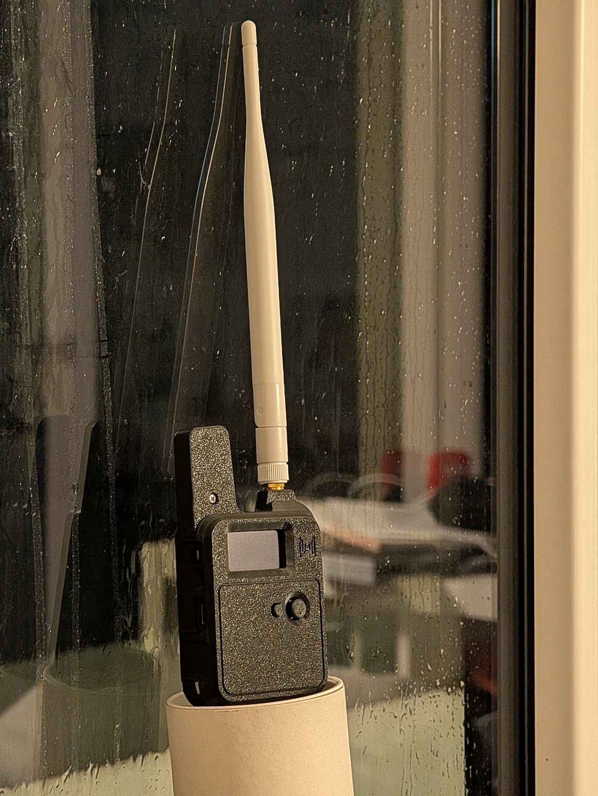
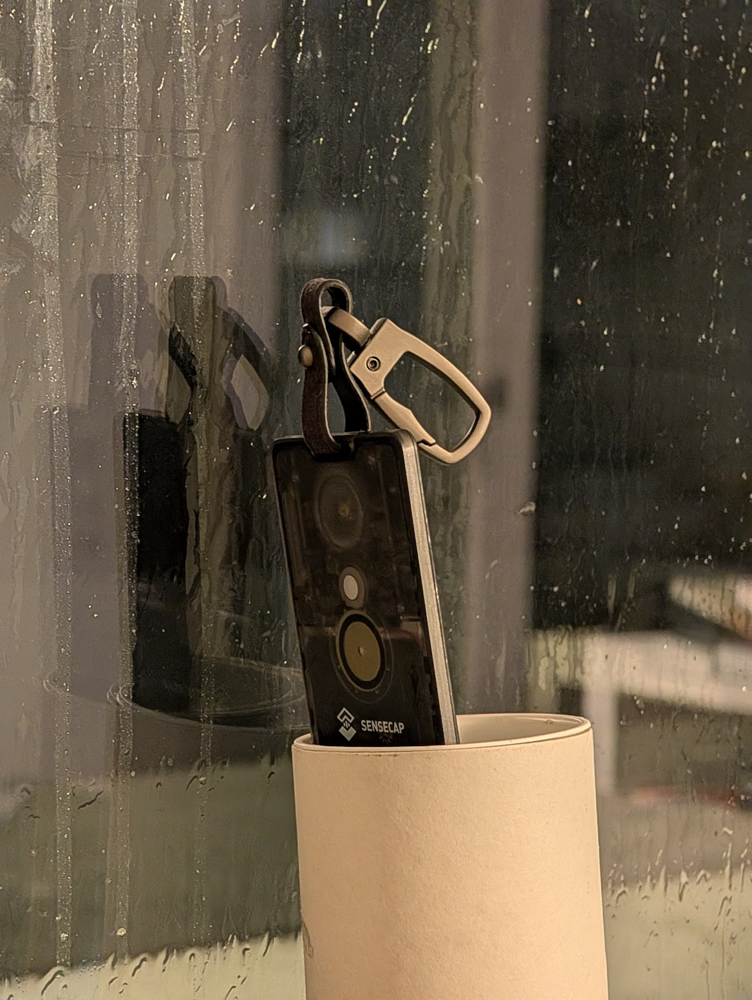
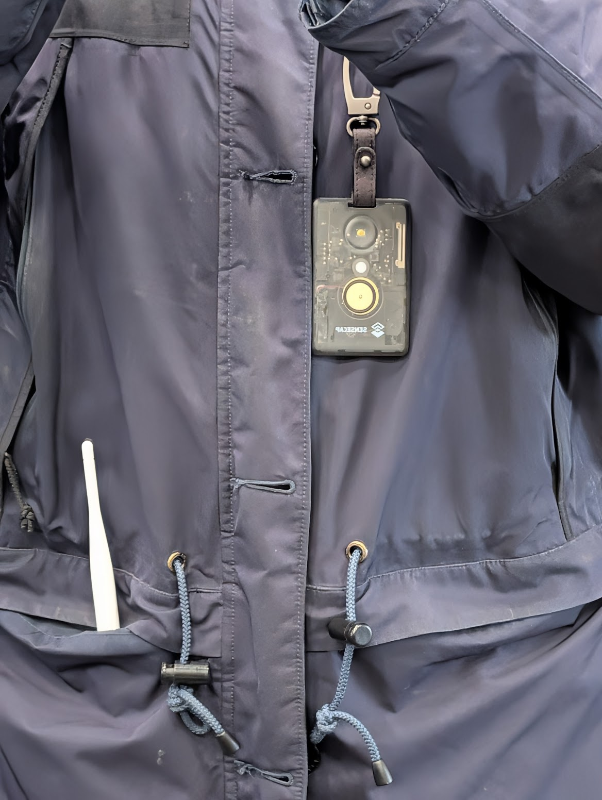
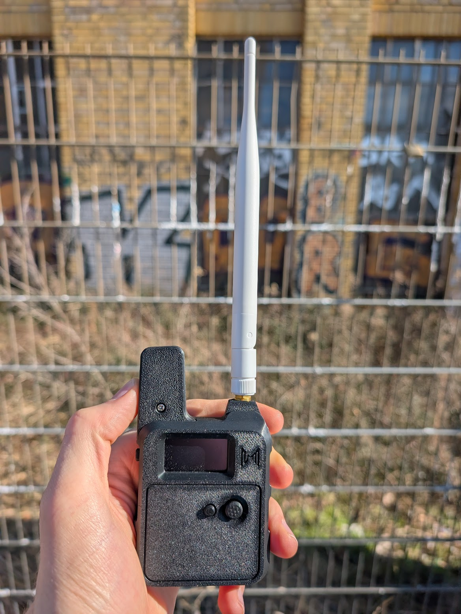
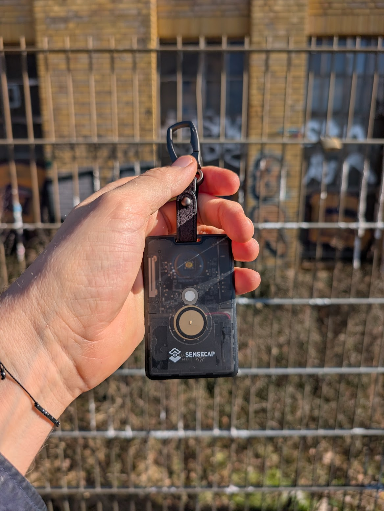

### Wio Tracker L1 vs. SenseCAP Card Tracker T1000-E

### Part I

## Introduction and limitations

Scope, approach, time limitations, and overall laziness — all of this contributes to the
not-so-scientific level of tests that I would like to present to the community.

However, considering all of this, I've tried my best to measure both devices accurately
and under similar conditions.

## Test setup

Both devices were positioned in the same place behind the window. Strong rain stopped me from doing it properly, so this test will be called "beta" — because it's better than nothing.

From both devices I measured ping to one of the nearby repeaters (~800 meters away, quite good reception, almost direct visibility with some minor obstacles).

All measurements were taken around 10 times. To calculate the final numbers, I excluded the best and worst results and took the average of what was left.

Wio L1 was fitted with a kinda-okay ~19 cm portable antenna from Amazon (10 euros, 2 pieces), SWR 1.5 around 868 MHz.

T1000-E has a built-in antenna.

## Results

### Wio Tracker L1

| **5.375 dBm there** | **11.28125 dBm here** |

### SenseCAP Card Tracker T1000-E

At first, the results were not looking great at all. After collecting samples, I got the following numbers:

| **2.1 dBm there** | **9.6 dBm here** |

I expected this — it fits well into what I thought the results should be: a small built-in antenna isn't even remotely close to a proper external antenna. But I had a feeling I was missing something.

Orientation! Both antennas were oriented vertically, but the T1000-E antenna can't be as omnidirectional as a proper external one.

So I turned the T1000-E 90 degrees and ran the tests again.

| **6.0625 dBm there** | **10.25 dBm here** |

The observed improvement after rotating the device likely results from changes in radiation pattern interaction with the nearby window surface and multipath reflections.

Here I decided to stop and continue in the next days — take some pictures, collect more samples, and do it properly.

New tests will follow.

### Part II

## Introduction and limitations

This series of tests was conducted in four locations. The first three were stationary, the fourth was used to emulate "typical" urban behavior. More about this later.

I deliberately decided not to use a dedicated stand, ground plane, or anything similar. Both trackers were positioned the way they would typically be used. Wio — inside a side pocket with the antenna facing up and out of the pocket. T1000-E was connected via a lace to the jacket, with the antenna facing outward.

In the first three locations I was facing the exact direction of the repeater antenna. In the fourth location I was wandering as randomly as possible (basically going in rounds within a 10×10 meter square).

## Results

### Wio Tracker L1

Measured mass with this case and 3000 mAh battery: 135 g.

### SenseCAP Card Tracker T1000-E

Measured mass with this case and 700 mAh battery: 56 g.

### Side-to-side comparison

## Remote Link (Repeater Side) (aka Uplink)

| Location | Wio L1 (Mean ± σ) | T1000-E (Mean ± σ) | Difference (Wio − T1000) |
| -------- | ----------------- | ------------------ | ------------------------ |
| 1        | 9.44 ± 3.06 dB    | 8.56 ± 1.31 dB     | **+0.88 dB**             |
| 2        | −1.63 ± 2.05 dB   | −4.23 ± 2.92 dB    | **+3.05 dB**             |
| 3        | 7.79 ± 3.12 dB    | 5.15 ± 2.10 dB     | **+2.64 dB**             |
| 4        | −7.07 ± 2.76 dB   | −8.69 ± 1.93 dB    | **+1.62 dB**             |

## Local Link (Device Side) (aka Downlink)

| Location | Wio L1 (Mean ± σ) | T1000-E (Mean ± σ) | Difference (Wio − T1000) |
| -------- | ----------------- | ------------------ | ------------------------ |
| 1        | 12.31 ± 0.59 dB   | 14.81 ± 0.72 dB    | **−2.50 dB**             |
| 2        | 12.05 ± 0.52 dB   | 13.75 ± 1.03 dB    | **−1.70 dB**             |
| 3        | 12.36 ± 0.66 dB   | 14.95 ± 0.87 dB    | **−2.59 dB**             |
| 4        | 10.79 ± 0.67 dB   | 9.81 ± 3.53 dB     | **+0.98 dB**             |

## Conclusion

Across all locations, the results show a consistent pattern.

On uplink (device → repeater), the Wio L1 delivered stronger average levels in every test location. The advantage ranged roughly between 1 and 3 dB depending on conditions. This is not a dramatic difference, but it is systematic. In LoRa terms, a 2–3 dB margin can translate into additional reliability when operating closer to the edge of coverage.

At the same time, on downlink (repeater → device), the T1000-E consistently showed stronger receive levels under identical conditions.

In several of the more challenging locations, where overall link conditions were poor, the practical effect became clearer. In those spots the Wio managed to successfully establish communication with the repeater roughly twice as often as the T1000-E. This aligns with the observed uplink advantage: when the link budget becomes critical, even a few dB start to matter.

So, on one hand, no miracle happened — an external antenna still performs better. Physics remains physics.

On the other hand, considering the significant difference in size, weight, and form factor, the T1000-E performs remarkably well. The gap is measurable, but smaller than one might intuitively expect.

When worn vertically on an external mount (for example, attached to a backpack with the antenna facing outward), T1000-e performance becomes notably more consistent and competitive.

In practical terms:  
If maximum uplink reliability near coverage limits is the priority, the external antenna of the Wio L1 provides additional headroom.  
If compactness and everyday usability are more important, the T1000-E delivers surprisingly strong performance for its size.
